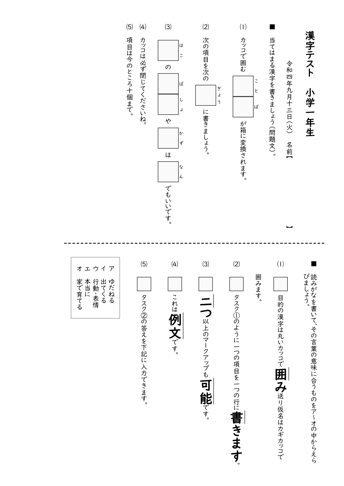

# Fancy Kanji Test Creator

This software allows the automated creation of simple one-page kanji tests as HTML files that can then be printed via the browser. 



## Installation

Precompiled binaries can be found under the releases tab.

If you want to compile from source, you can download the source code and run `pyinstaller --onefile .\create_test.py` from the main directory.

## How to use

This script reads the data from a text file with a custom markup. This is also the structure of the `kanji_test_template.txt` file.

```
title: 漢字テスト
gakunen: 小学一年生
date: 令和四年九月十三日（火）

task_1:
instructions: 当てはまる漢字を書きましょう(問題文)。
1. カッコで囲む（こと）（ば）が箱に変換されます。
2. 次の項目を次の（ぎょう）に書きましょう。
3. （はこ）の（ば)(しょ）や（かず）は（なん）でもいいです。
4. カッコは必ず閉じてくださいね。
5. 項目は今のところ十個まで。

task_2:
instructions: 読みがなを書いて、その言葉の意味に合うものをア～オの中からえらびましょう。
1. 目的の漢字は丸いカッコで【（囲）み】送り仮名はカギカッコで囲みます。
2. タスク①のように一つの項目を一つの行に【（書）きます】。
3. 【（二）つ】以上のマークアップも【（可能）】です。
4. これは【（例文）】です。
5. タスク②の答えを下記に入力できます。

answers:
1. ゆだねる
2. 出てくる
3. 行動・表情
4. 本当に
5. 家で育てる

==================== END OF INPUT =================================
There must be at least one empty line above this line. All other empty lines also need to stay. Multiple empty lines and trailing whitespace is automatically removed. 
Basically, all Japanese characters can be changed, the remaining structure of the document should stay the same.
For **Task 1**, two parentheses "（ふりがな）" create an empty text box with the text in parentheses as ruby above it. 
For **Task 2**, the square brackets 【 】create a strong tag and the parentheses （　）create an overline for the kanji.
Parentheses and brackets can be either double or single-spaced, but not mixed.
```

### Creating a test

Write the questions in a text file according to the structure above.
Running the `.exe` then prompts the user to choose a text input file. The script will create an `.html` file with the same name in the same directory as the text file. For printing, I recommend using [Firefox browser](https://www.mozilla.org/firefox/) as it has better support for vertical Japanese text (as of Sep 13th 2022). For best results, disable header and footer, and enable background images in the print dialog. 

### Attributions

This script uses [dominate](https://github.com/Knio/dominate) to create the file from different variables in python. The input is a custom simple markup to indicate the location of the kanji boxes. 

Binary compilation has been done with [pyinstaller](https://pyinstaller.org).

<a href="https://www.flaticon.com/free-icons/kanji" title="kanji icons">Kanji icons created by Freepik - Flaticon</a>